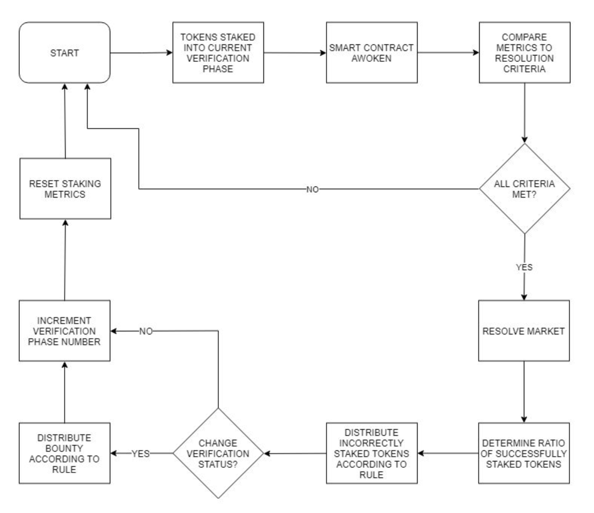

# Oracle Game - White Paper

* [**1. Introduction**](#1-introduction)
  * [1.1 What is the Oracle?](#11-what-is-the-oracle)
  * [1.2 How does the Oracle work?](#12-how-does-the-oracle-work)
     * [1.2.1 Example Internal Metrics](#121-example-internal-metrics)
     * [1.2.2 Example Compound Metrics](#122-example-compound-metrics)
     * [1.2.3 Example Resolution Criteria](#123-example-resolution-criteria)
     * [1.2.4 Example Resolution Engines](#124-example-resolution-engines)
     * [1.2.5 Flow chart](#125-flow-chart)
* [**2. Rules of the game**](#2-rules-of-the-game)
   * [2.1 What is the Test Statement](#21-what-is-the-test-statement)
   * [2.2 How to Stake Tokens](#22-how-to-stake-tokens)
   * [2.3 Rewards](#23-rewards)
* [**3. Worked Examples**](#3-worked-examples)
   * [3.1 Simple Threshold Resolution Engine, One Staker on `true`](#31-simple-threshold-resolution-engine-one-staker-on-true)
   * [3.2 Simple Threshold Resolution Engine, Two Stakers on `true`](#32-simple-threshold-resolution-engine-two-stakers-on-true)
   * [3.3 Simple Threshold Resolution Engine, One Staker on `true` and One on `false`](#33-simple-threshold-resolution-engine-one-staker-on-true-and-one-on-false)
   * [3.4 Simple Threshold Resolution Engine, Two Stakers on `true` (with Overstaking)](#34-simple-threshold-resolution-engine-two-stakers-on-true-with-overstaking)
    
## 1. Introduction

This paper introduces hubii’s Oracle product, a very early version of which will be deployed to Ethereum’s mainnet as part of a public game. In addition to setting out what the Oracle is, this paper will also explain how players can participate in the public game and claim potentially significant rewards.

Please note that the version of the Oracle set out here is designed to be _deliberately exploitable_. We welcome players attempting to game the system, including working together to attack the Oracle and claim the bounty.

During the public game, hubii will experiment with a range of rules and rewards. We will then observe and record the results to generate a range of test data. At times, it may not always be obvious to the public exactly what we are testing or why. This is intentional; revealing the purpose of a public test in advance can sometimes bias the outcome.

This early version of the Oracle will be used to provide valuable test data for hubii’s primary use case for the Oracle product. The full version of the Oracle will monitor data availability for hubii’s nahmii protocol; however, the full Oracle product will not be tasked to protect nahmii from data withholding attacks until it has been tested rigorously.

Please note that this is a living document, which will be updated as the public testing of the Oracle continues.

### 1.1 What is the Oracle?

The Oracle is a tool for testing the truth functionality of a statement using a decentralised consensus mechanism. Consensus is determined through token staking, with participants risking their tokens in order to potentially claim a share of the reward payout and tokens staked against them. **Only NII tokens will be accepted for staking into the Oracle.** The Oracle operates fully on chain using smart contracts to determine when a staking round is over and who should receive the payout.

Statements tested by the Oracle must be truth functional; in other words, they must be capable of being objectively `true` or `false`. As an example, the statement ‘the sun rises in London at 7am on 1st May’ is truth functional, while ‘this picture of the sunrise in London is beautiful’ is not[[1]](#footnote1).

The proposition tested by the Oracle is known as the **test statement**, which usually presents two options for participants: `true` or `false`. This is the most simple case; the Oracle is also compatible with test statements which have multiple outcomes, provided that only one can be `true` at any given time.

Participants engage with the Oracle by staking tokens directly into the Oracle’s smart contracts. The Oracle can handle multiple queries at once, with each test statement being represented by its own staking **market**. Each market has its own rules governing when the staking process should be closed, these rules are managed by **resolution engines** which draw on staking metrics known as **resolution criteria**. When the criteria for closing the current round of staking are met, the market is said to **resolve** in favour of one result. The public game will eventually feature multiple resolution engines running in parallel.

In short: participants staking tokens into the Oracle informs certain **metrics**, this in turn provides the data which determines when the current staking round should close. Participants who stake their tokens ‘correctly’ (i.e. on the option which prevails) are rewarded with a payout from the initial bounty and a share of the ‘incorrectly’ staked tokens (i.e. stakes on the alternative options).

We can choose whether the Oracle will run for one round of staking or many, with each round of staking known as a staking **verification phase**. The public game version of the Oracle will run for multiple phases.

### 1.2 How does the Oracle work?

The Oracle functions by way of participants staking tokens. In the simple case, participants stake their tokens against whether a test statement is `true` or `false`. When these stakes are sufficient to meet the resolution criteria, the current phase of staking ends and the market is resolved. The Oracle then determines that the test statement is `true` or `false`, with this **result** being carried forward to the next round of staking if required.

Participants are incentivised to stake their tokens into the Oracle in two ways: first, each staking market has a **bounty** which is paid out to successful stakers (more on this later) when the result is different from the previous phase; second, participants who stake their tokens on the prevailing outcome are rewarded with a proportional share of the tokens staked in the opposite direction. As an example, you will receive a proportional share of the bounty and the tokens staked on `false` if you have staked your tokens on `true` and the market resolves as `true`.

The rules by which payouts are distributed can change; however, they will always be fixed for a given phase.

Token staking in this way generates a large amount of useful data, which we can measure using metrics. It is helpful to provide some example metrics here:

#### 1.2.1 Example Internal Metrics

*   The number of tokens staked on `true`
*   The number of tokens staked on `false`
*   The number of tokens staked overall
*   The number of addresses staking tokens
*   The number of tokens staked per address
*   The number of tokens staked in each block
*   The current block number
*   The number of blocks mined since the market opened
*   The number of tokens posted for the Bounty
*   The current Verification Phase Number

#### 1.2.2 Example Compound Metrics

*   The number of tokens staked on `true` relative to `false`
*   The number of addresses staking tokens, with a minimum staking requirement
*   The total number of tokens staked relative to the size of the Bounty
*   The composition of recent votes, i.e. what percentage of the last _x_ votes were for each option

These metrics can then be used to inform the resolution criteria, which are conditional statements based on one or more metrics. Some examples are provided here:

#### 1.2.3 Example Resolution Criteria

*   The number of tokens staked on `true` is greater than 100 NII
*   The number of unique addresses staking tokens is greater than 10
*   The total number of tokens staked into the current verification phase is greater than 10,000 NII

Finally, we can combine resolution criteria together to create conditional rules about when to end the current staking round. These sets of conditional rules are managed by ‘resolution engines’. We will deploy multiple resolution engines for the Oracle game, each of which will have an associated bounty fund. All of the resolution engines deployed for the Oracle game should be considered _deliberately exploitable_. Examples are provided below:

#### 1.2.4 Example Resolution Engines

1. Resolve the staking market when:
    * The total number of tokens staked on either option reaches &alpha; NII
2. Resolve the staking market when:
    * The total number of tokens staked on either option reaches &alpha; NII, **AND**,
    * The percentage of tokens staked on either option across the market exceeds &beta;
3. Resolve the staking market when:
    * The total number of tokens staked on either option reaches &alpha; NII, **AND**,
    * The percentage of tokens staked on either option across the market exceeds &beta;, **AND**,
    * The total number of unique addresses staking tokens into the current verification phase exceeds &delta;

It should now be clear how the Oracle functions; participants stake their tokens against `true` or `false` for a given statement and this generates measurable data. Using this data, the Oracle checks whether the requirements for ending the current round of staking have been met. If these requirements have not been met, the Oracle awaits further staking. If all conditions are satisfied, the market closes and rewards are assigned to the appropriate token stakers. Rewards can be claimed from the smart contracts directly.

There are two further noteworthy features of the Oracle’s design. We have the ability to alter the parameters for each resolution engine, so as to test different scenarios within the same ruleset. Changes of this type will only apply to the _following_ verification phase; we cannot alter the rules for the current staking round. 

Similarly, the Oracle design includes provisions for shutting down resolution engines if required. This may be necessary if the Oracle has become ‘stuck’, with no easy way to resolve the current phase, or simply as a housekeeping measure for dormant markets. The shutdown process for an Oracle includes a 30-day warning period, during which no further stakes are permitted. Once this period ends, participants can claim their staked tokens back from the smart contracts directly.

A simple flow chart explaining how the Oracle works is included below:

#### 1.2.5 Flow Chart

## 2. Rules of the Game

### 2.1 What is the Test Statement?

The test statement for the Oracle will be published in the Oracle GitHub repo, where you can see all previous test statements. **You should always check this repo for the latest test statement, do not presume that the initial test statement below is still valid**. For reference, we have included the first test statement here.

The initial test statement for the Oracle (beginning 26/09/2019) will be:

> ‘The ‘bonus ball’ drawn in the last UK ‘lotto’ draw was between 01 and 20 (inclusive)’

The UK ‘lotto’ is drawn twice per week, at 8pm on Wednesday and 7.45pm Saturday evening (local time). The draw is broadcast live on YouTube and UK television, with the results published across a wide range of online and print media[[2]](#footnote2).

In this example, the UK lotto has 59 balls giving a 20/59 or 33.9% chance that the test statement will be `true`. 

Looking at the most recent lotto draw (Wednesday 25th September 2019), the bonus ball was 47. In this case, participants who stake their tokens truthfully would be expected to stake their tokens on `false` (as 47 is not between 1 and 20, inclusive).

Similarly, in the lotto draw on Saturday 7th September the bonus ball was 08. Truthful participants in the lottery Oracle would now be expected to stake their tokens on `true` (as 08 is between 01 and 20, inclusive).

These examples indicate the basic staking behaviour expected of participants in the Oracle game.

Importantly, the lotto draw schedule will produce two results each week. As such, players might stake their tokens honestly (i.e. on the correct option) based on one draw only to find that the relevant result has changed _before the current phase ends_. This is best illustrated by an example: if I had staked my tokens honestly on `true` when the relevant result was `true` and the Oracle had not resolved before the when the relevant result changed to `false`, my tokens would then be staked ‘dishonestly’. In this scenario, my tokens would be lost if the market then resolved the correct way (`false`) _even though my tokens were staked honestly_.

Participants should therefore be aware of the risk that the market will not resolve before the next draw. 

Similarly, there is also the risk that other users will attempt to deliberately subvert the Oracle by causing it to return the incorrect result, thus ‘stealing’ the tokens which were correctly staked during the current verification phase. This is expected - even encouraged - behaviour during the Oracle game.

### 2.2 How to Stake Tokens

Staking tokens into the Oracle is a fully on-chain process using Ethereum smart contracts. Participants simply call the appropriate smart contract function, `stake()`, and provide the following information:

*   Resolution engine - `Resolution Engine Address`
*   Staking phase number - `phaseNumber`
*   Direction of staking (i.e. `true` or `false`) - `direction`
*   Number of tokens to stake - `stakeAmount`

Note that we will eventually have more than one resolution engine running in parallel. This explains why the user must specify which resolution engine they wish to stake tokens into.

### 2.3 Rewards

There are two potential rewards available for participating in the Oracle. First, participants who stake their tokens on the prevailing outcome (i.e. they stake `true` and the Oracle resolves `true`) will receive a proportional share of the tokens staked against them. Second, the Oracle will pay out a bounty if the result of the current verification phase is different to that of the previous one. If the previous staking phase resolved as `false` and the current one as `true`, this will trigger the bounty payout. If the current phase resolves in the same direction as the previous one, i.e. `true` and `true` or `false` and `false`, no bounty is paid out.

Please note that the bounty payout rules can vary; we may choose, as an example, to pay out a greater share of the bounty to participants who stake tokens at the beginning of the verification phase. **Importantly, the bounty is only paid out when the verification status changes; if the Oracle resolves as `true` for the current verification phase and the initial verification status was `true`, this will not trigger a bounty payout.** This is designed to prevent participants from draining the bounty fund by repeatedly confirming that a test statement is `true` (or `false`).

The rules for paying out losing stakes to the winners will always remain the same: eligible participants will be rewarded on a proportional basis for all stakes which contributed to the outcome. 

This final part of the requirement, ‘contributed to the outcome’, is crucial to avoid paying out on ‘overstaked’ tokens. Consider the example where 99 tokens have been staked on both `true` and `false`, where the requirement for resolving the market is the first option to reach 100 tokens staked. If the next participant resolves the market by staking 1 token on `true`, they will receive 1% of the tokens staked on `false` as a reward (reflecting their contribution to winning total of 1/100). Had this person staked 99 tokens instead, they would have contributed 50% to the total staked on `true` - should they receive 50% of the reward? No. This is an example of ‘overstaking’, where we do not count the additional tokens staked over the threshold for the purpose of calculation reward payouts. Overstaked tokens can be reclaimed from the smart contract along with any payout due.

## 3. Worked Examples

Each of these examples assumes that the final verification status of the Oracle is different to the initial verification status, thus triggering a payout of the bounty fund for that verification phase. If the current verification phase simply confirms the initial verification status, no bounty fund payout will be due. 

### 3.1 Simple Threshold Resolution Engine, One Staker on `true`

In this first illustrative example, the resolution engine uses the following rule to determine when to resolve the Oracle: \
 \
Resolve the staking market when:

* The total number of tokens staked on either `true` or `false` reaches 100 NII

The total bounty fund for this resolution engine is set to 100 NII, with 10% of the fund allocated to the current verification phase as a bounty.

If the current verification phase is number 1, then the bounty for this phase will be 10 NII.

**Alice stakes 100 NII tokens on `true` for verification phase 1**. This meets the requirement that the number of tokens staked on either `true` or `false` is greater than or equal to 100. The Oracle therefore resolves as `true` and Alice is awarded 100% of the bounty fund for this verification phase: 10 NII. Alice can now claim her staked tokens (100 NII) and share of the bounty fund (10 NII) from the smart contract.

### 3.2 Simple Threshold Resolution Engine, Two Stakers on `true`

Using the same resolution engine as above in (3.1), we can now address an example where two parties stake in the same direction:

Resolve the staking market when:

* The total number of tokens staked on either `true` or `false` reaches 100 NII

The total bounty fund for this resolution engine is set to 100 NII, with 10% of the fund allocated to the current verification phase as a bounty.

**Alice stakes 50 NII tokens on `true` for verification phase 1**. The smart contract checks whether this new stake satisfies the requirement for resolving the Oracle; it does not (as the total number of tokens staked on either `true` or `false` is not greater than or equal to 100 NII).

**Bob stakes 50 NII tokens on `true` for verification phase 1**. The smart contract checks whether this new stake satisfies the requirement for resolving the Oracle; it does (as now the total number of tokens staked on `true` is greater than or equal to 100 NII).

The Oracle therefore resolves `true`. As Alice and Bob have both made an equal contribution to the outcome, they are each allocated 50% of the bounty fund for this verification phase (5 NII). Alice and Bob can now claim their staked tokens plus their share of the bounty fund (55 NII each) from the smart contract.

### 3.3 Simple Threshold Resolution Engine, One Staker on `true` and One on `false`

Using the same resolution engine as above (3.1), we can now address an example where two parties stake different amounts in opposite directions:

Resolve the staking market when:

* The total number of tokens staked on either `true` or `false` reaches 100 NII

The total bounty fund for this resolution engine is set to 100 NII, with 10% of the fund allocated to the current verification phase as a bounty.

**Alice stakes 50 NII tokens on `true` for verification phase 1**. The smart contract checks whether this new stake satisfies the requirement for resolving the Oracle; it does not (as the total number of tokens staked on either `true` or `false` is not greater than or equal to 100 NII).

**Bob stakes 100 NII tokens on `false` for verification phase 1**. The smart contract checks whether this new stake satisfies the requirement for resolving the Oracle; it does (as now the total number of tokens staked on `false` is greater than or equal to 100 NII).

The Oracle therefore resolves `false`. Bob is the only person to contribute this outcome and is therefore allocated 100% of the bounty fund for verification phase 1 (10 NII). In addition, Bob receives the same percentage of tokens staked in the opposite direction (100% of Alice’s 50 NII, which is 50 NII). Bob can now claim his staked tokens (100 NII), share of the bounty fund (10 NII) and share of tokens staked in the opposite direction (50 NII, for a total of 160 NII) from the smart contract. Alice loses her tokens, as she staked incorrectly.

### 3.4 Simple Threshold Resolution Engine, Two Stakers on `true` (with Overstaking)

Using the same resolution engine as above (3.1), we can now address an example where two parties stake different amounts in the same direction and the second stake exceeds the threshold:

Resolve the staking market when:

* The total number of tokens staked on either `true` or `false` reaches 100 NII

The total bounty fund for this resolution engine is set to 100 NII, with 10% of the fund allocated to the current verification phase as a bounty.

**Alice stakes 90 NII tokens on `true` for verification phase 1**. The smart contract checks whether this new stake satisfies the requirement for resolving the Oracle; it does not (as the total number of tokens staked on either `true` or `false` is not greater than or equal to 100 NII).

**Bob stakes 110 NII tokens on `true` for verification phase 1**. The smart contract checks whether this new stake satisfies the requirement for resolving the Oracle; it does (as now the total number of tokens staked on `true` is greater than or equal to 100 NII).

The Oracle therefore resolves `true`. Alice and Bob have both made a contribution to the outcome of the current verification phase, but with unequal stakes. Importantly, the Oracle will only assess useful contributions when calculating the payout from the bonus fund. All of Alice’s 90 NII stake contributed usefully to the outcome, while only 10 NII tokens from Bob’s 110 NII stake made a difference in this way. As such, Alice is allocated 90% of the bounty fund in proportion to her useful contribution (9 NII) and Bob receives 10% (1 NII).

Alice and Bob can now claim their staked tokens (90 NII and 110 NII, respectively) plus their share of the bounty fund (9 NII and 1 NII, respectively) from the smart contract.

### Notes

<a name="footnote1">[1]</a>: While the Oracle is technically capable of addressing subjective questions of this sort, that is not being tested here.

<a name="footnote2">[2]</a>: [https://www.national-lottery.co.uk/results/lotto/draw-history](https://www.national-lottery.co.uk/results/lotto/draw-history)
